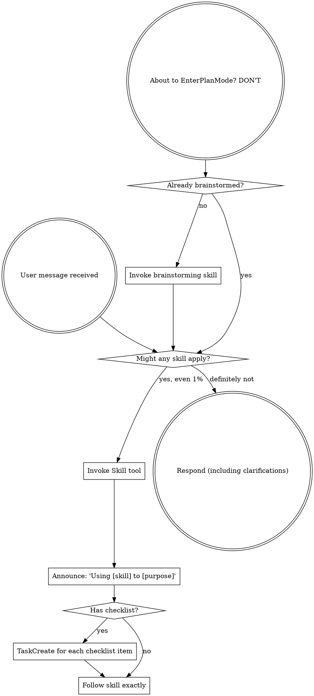

<SUBAGENT-STOP>
If you were dispatched as a subagent to execute a specific task, skip this skill.
</SUBAGENT-STOP>

<EXTREMELY-IMPORTANT>
If you think there is even a 1% chance a skill might apply to what you are doing, you ABSOLUTELY MUST invoke the skill.

IF A SKILL APPLIES TO YOUR TASK, YOU DO NOT HAVE A CHOICE. YOU MUST USE IT.

This is not negotiable. This is not optional. You cannot rationalize your way out of this.
</EXTREMELY-IMPORTANT>

## Instruction Priority

Superpowers skills override default system prompt behavior, but **user instructions always take precedence**:

1. **User's explicit instructions** (`AGENTS.md`, `.github/copilot-instructions.md`, direct requests) — highest priority
2. **Superpowers skills** — override default system behavior where they conflict
3. **Default system prompt** — lowest priority

If `AGENTS.md` or `.github/copilot-instructions.md` says "don't use TDD" and a skill says "always use TDD," follow the user's instructions. The user is in control.

## How to Access Skills

**In Copilot CLI (this runtime):** Use the `skill` tool. Skills are auto-discovered
from installed plugins by their `description` frontmatter — when a request matches a
skill's description, invoke it with the `skill` tool to load its full content, then
follow it directly. Never use the `view` tool to read a SKILL.md instead of invoking it.

**In Claude Code:** Use the `Skill` tool (the Copilot CLI `skill` tool is the direct
equivalent).

**In other environments:** Check your platform's documentation for how skills are loaded.

## Platform Adaptation

These skills were authored with Claude Code tool names. On Copilot CLI:

- **Tool names** — map Claude tool names to Copilot CLI tools using
  `references/copilot-tools.md` (`Read`→`view`, `Write`→`create`, `Edit`→`edit`,
  `Bash`→`bash`, `Task`→`task`, `AskUserQuestion`→`ask_user`, etc.).
- **Native tasks** — whenever a skill uses `TaskCreate` / `TaskGet` / `TaskUpdate` /
  `TaskList`, `json:metadata`, or task dependencies, use the `sql` tool on the
  `todos` + `todo_deps` tables as described in `references/task-management.md`. This
  is how dependency enforcement (no front-running) and real-time task visibility are
  reproduced on Copilot CLI.
- **Plan mode** — there is no `EnterPlanMode`/`ExitPlanMode`. Write plans to a file
  and pause for user review; stay in the main session.

# Using Skills

## The Rule

**Invoke relevant or requested skills BEFORE any response or action.** Even a 1% chance a skill might apply means that you should invoke the skill to check. If an invoked skill turns out to be wrong for the situation, you don't need to use it.

## Red Flags

These thoughts mean STOP—you're rationalizing:

| Thought | Reality |
|---------|---------|
| "This is just a simple question" | Questions are tasks. Check for skills. |
| "I need more context first" | Skill check comes BEFORE clarifying questions. |
| "Let me explore the codebase first" | Skills tell you HOW to explore. Check first. |
| "I can check git/files quickly" | Files lack conversation context. Check for skills. |
| "Let me gather information first" | Skills tell you HOW to gather information. |
| "This doesn't need a formal skill" | If a skill exists, use it. |
| "I remember this skill" | Skills evolve. Read current version. |
| "This doesn't count as a task" | Action = task. Check for skills. |
| "The skill is overkill" | Simple things become complex. Use it. |
| "I'll just do this one thing first" | Check BEFORE doing anything. |
| "This feels productive" | Undisciplined action wastes time. Skills prevent this. |
| "I know what that means" | Knowing the concept ≠ using the skill. Invoke it. |

## Skill Priority

When multiple skills could apply, use this order:

1. **Process skills first** (brainstorming, debugging) - these determine HOW to approach the task
2. **Implementation skills second** (frontend-design, mcp-builder) - these guide execution

"Let's build X" → brainstorming first, then implementation skills.
"Fix this bug" → debugging first, then domain-specific skills.

## Skill Types

**Rigid** (TDD, debugging): Follow exactly. Don't adapt away discipline.

**Flexible** (patterns): Adapt principles to context.

The skill itself tells you which.

## User Instructions

Instructions say WHAT, not HOW. "Add X" or "Fix Y" doesn't mean skip workflows.
